# Agent Architecture and Flow

This document visualizes the exact sequence of events that happens when you ask the agent a question.

## The ReAct (Reason + Act) Loop

```mermaid
sequenceDiagram
    actor User
    participant Agent as Python Script (agent.py)
    participant LLM as Ollama (llama3.2)
    participant Tools as tools.py

    User->>Agent: "What's 15 * 5?"
    
    rect rgb(30, 30, 30)
    Note over Agent, LLM: Turn 1: Planning & Tool Request
    Agent->>LLM: Send user prompt + available tools definition
    LLM-->>Agent: Request to run tool: calculate(expression="15 * 5")
    end
    
    rect rgb(30, 40, 50)
    Note over Agent, Tools: Action Execution
    Agent->>Tools: AVAILABLE_FUNCTIONS["calculate"]("15 * 5")
    Tools-->>Agent: "75"
    end
    
    rect rgb(30, 30, 30)
    Note over Agent, LLM: Turn 2: Synthesis
    Agent->>LLM: Send previous context + Tool Result ("75")
    LLM-->>Agent: Final Answer: "The result of 15 * 5 is 75."
    end
    
    Agent->>User: Display Final Answer
```

### Flow Breakdown
1. **User Input:** You run the script with a query.
2. **First Prompt:** The Python script packages your query alongside a JSON description of every available tool, sending it to the local Ollama LLM.
3. **LLM Decision:** The LLM reads the query. It realizes it cannot do math reliably. It decides to use the `calculate` tool. It returns a structured JSON response asking the Python script to run it.
4. **Python Execution:** The Python script parses the LLM's request, finds the `calculate` function in `tools.py`, runs it locally, and captures the result string `"75"`.
5. **Second Prompt:** The Python script sends a new message back to the LLM: *"The tool 'calculate' returned '75'"*.
6. **Final Synthesis:** The LLM receives the answer to its tool request, formulates a natural language sentence, and sends it back. Since it didn't request any more tools, the Python script breaks the loop and prints the final answer to the screen.
